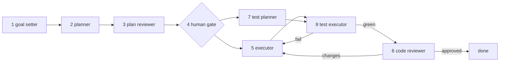

# Milestone 1 — Agent team + ledger, in plain text

**Scope:** the eight-role pipeline plus a briefer, and the shared ledger, driven from the Gateway in text. No voice, no phone, no briefing-style work.
**Running on:** `openclaw@beta` `2026.8.1-beta.3`. The beta channel is required, not preferred — see D1 and step 1.

---

## Where this stands

Read this first. Setup instructions are in [SETUP.md](SETUP.md).

| Step | State |
|---|---|
| 1 — Swarm spike | **done.** Blocked on stable, passed on `@beta` |
| 2 — Ledger | **done.** Postgres, two tables, six indexes, migration committed |
| 3 — Plugin | **done.** `ledger_write` / `ledger_query`, child-callable, citation guard |
| 4 — Nine role configs | **done.** All nine verified in character across two providers |
| — Sandbox (D11) | **done.** Containers, one project bind, no network egress |
| 5 — Phase-1 script and the gate | **done.** `remi-plan.js` ran end to end; `remi-gate.js` records the decision |
| 6 — Phase-2 script | **written**, gate-refusal verified; first full run pending Quan's gate decision |
| — Interview (front door) | **written**, never run end to end |

### Next action

Everything is built. What remains is running it.

| # | Task | Blocking |
|---|---|---|
| 1 | Quan's decision at gate row 35 on `the-repository-has-20260824-i2m` | **blocks the first full run** |
| 2 | One end-to-end run: interview → plan → gate → build → test → review | the acceptance criterion |
| 3 | Walk the interview once, as the front door of a demo | never exercised |

Both step-6 blockers cleared during the merge: `docker/sandbox-node.Dockerfile` gives `executor` and
`test-executor` Node 24, and the root `package.json` runs `node --test`. Verified independently by
running the image with the real bind and `network: none` — 15 tests, green, offline.

The parked plan is the natural first job. Two of its five steps landed by hand during the merge, so
what remains is its one substantive step: making the containment test import the shipped predicate
instead of a copy of it. Small, real, and the correct answer is already known — which is what makes
it a good first exercise of a pipeline nobody has watched work yet.

**Handover sequencing, decided.** Step 5 gets written conventionally rather than by Remi. Having
Remi invent the pipeline that is meant to constrain it inverts the point, and there would be no
gate while it did so. Hand over at step 6: by then the loop exists and the instruction is "run
your own pipeline" rather than "invent one".

Two open questions to settle while doing it:

1. **Reviewer thinking level, and whether `xhigh` is honoured at all.** `xhigh` measured 212 s
   against `off` at 42 s on the same agent, which looked like proof the level was being applied.
   It is not proof: that run spent its time searching the filesystem for files that did not exist
   (D10), so the latency gap measures thrashing, not reasoning. The provider does advertise the
   full ladder, but the behavioural evidence is void. Re-measure with a real repo mounted and the
   root stated. `high` may be the better trade.
2. **Worker tool profiles.** Roles carry the full `coding` profile, including tools no lane
   contract mentions — `automations` alone is roughly 15% of the schema payload. Trim to observed
   need after watching a real run, not before.

### Verifying an agent's claims about itself

Four times now an agent has confidently misdescribed itself: it reported a tool as available while
its own catalog proved otherwise, reported reviewing this project while reading another, reported
running on the host while `sandbox explain` showed it containerised, and reported that
`remi-gate.js` had created a ledger row that had in fact been seeded in Postgres beforehand.

The fourth is the instructive one, because the claim was about a *side effect* rather than an
environment, and it was flattering to the code under test. Verify side effects the same way:
from outside.

Check environmental claims from outside the sandbox. `sandbox explain`, `plugins inspect`, a direct
`psql` query, and `ls` from a host shell are all cheap. An agent's self-report is a hypothesis.

### What is not in this repository

`apply-roles.mjs` reproduces all OpenClaw configuration from `roles/roles.json`. It cannot
reproduce: the npm install, the two provider credentials, the sandbox image build, the ledger
container, or the `--link` plugin install. Those are steps 1–4 of SETUP.md.

---

## Acceptance criterion

One criterion, deliberately singular:

> One non-trivial change to the Remi repository itself goes goal → plan → review → approval → code → test → review → pass, entirely through the pipeline, with every stage traceable in the ledger, and one approval gate that Quan actually used to redirect the plan.

Self-hosting is the honest test. A pipeline that cannot build Remi cannot build Pholio.

Sub-criteria, each independently verifiable:

| # | Criterion |
|---|---|
| A1 | Every stage writes at least one ledger row with a resolvable `reference` |
| A2 | The plan reviewer's findings appear in the pre-gate brief before Quan sees the plan |
| A3 | Quan's redirection at the gate is recorded as a `type: approval` row and visibly changes the plan the executor receives |
| A4 | The test planner's scenarios are derived from acceptance criteria only, provably — its prompt contains no plan text and no code |
| A5 | A deliberately failing test drives at least one executor rework pass, and the loop terminates |
| A6 | A fresh session reconstructs the full state of the work from the ledger alone, with no conversation history |

---

## What OpenClaw provides, and what it does not

Verified against source, not documentation summaries.

| Capability | Status | Where |
|---|---|---|
| Isolated child sessions with fresh transcripts | Provided | `docs/tools/subagents.md:118-133` |
| Structured child results validated against JSON Schema | Provided, experimental opt-in | `docs/tools/swarm.md:97-222` |
| Script-driven orchestration (`agents.run`, `Promise.all`, `while`) | Provided via Code Mode + Swarm | `docs/tools/swarm.md:12-19` |
| Push-based completion, no polling | Provided | `sessions_yield`, `docs/tools/subagents.md:301-347` |
| Per-role model, workspace, tool profile, sandbox | Provided | `agents.entries.*`, `src/config/types.agents.ts:84-172` |
| Internal event bus (42 hooks) | Provided | `src/plugins/hook-types.ts:92-133` |
| Plugin-registered tools | Provided | `api.registerTool`, `src/plugins/plugin-api.types.ts:198-201` |
| **A workflow engine or role registry** | **Not provided** | Swarm docs: "There is no graph DSL and no separate workflow format. The program is the orchestration." |
| **Human approval inside a subagent** | **Not provided** | Collector children fail closed; a child never opens an approval prompt — `docs/tools/swarm.md:266-268` |
| **Generic plugin storage layer** | **Not provided** | Plugins bring their own persistence |

An OpenClaw "agent" is a persona bound to a channel, not a pipeline stage. Eight `agents.entries` produce eight chat personas. The pipeline is a program that calls them.

---

## Architecture decisions

### D1 — The orchestrator is a program, not an agent

Two Code Mode scripts drive the pipeline. Stage sequencing is `await`. Parallelism is `Promise.all`. Bounded rework is `while`.

Consequence, and the reason this matters most: **orchestration state lives in JavaScript variables, which cost zero tokens.** A thirteen-stage pipeline accumulates no context. Compare a conventional agent loop, where by stage twelve the model reasons over eleven stages of stale detail.

### D2 — The ledger is the record, not the message bus

Superseded from the original design: agents do not query the ledger for work. The plan reviewer *returns* findings as validated JSON; the script passes them into the next prompt. No query round-trip, no "did the child see my row" race.

The ledger retains three real jobs:

1. Audit trail, including every point Quan steered.
2. Context reconstruction after a reset (criterion A6).
3. Carrying prior findings and prior attempts forward into fresh review and rework rounds (see D5).

### D3 — No Redis

Superseded. The doorbell already exists: the Swarm scheduler lane, 42 host hooks including `subagent_spawned` / `subagent_progress` / `subagent_ended`, and push-based `sessions_yield` completion. OpenClaw's docs explicitly forbid polling loops. Redis would add an operational dependency and buy nothing.

### D4 — The human gate is a script boundary

A subagent cannot request approval. The inline alternative — a plugin `before_tool_call` hook returning `requireApproval` — is hard-capped at a 10 minute timeout and then fails closed (`docs/plugins/plugin-permission-requests.md:88-101`). Useless mid-walk.

So phase 1 ends at the gate, briefs Quan, and exits. Quan's reply is an `approval` row and starts phase 2. Unbounded wait, survives a gateway restart, survives a phone going into a pocket.

Inline `requireApproval` stays available later for quick in-flight confirmations.

### D5 — Every round is a fresh session, with history passed as data

`agents.run` always creates a new isolated session, so this is the default rather than something to build. It avoids two failure modes:

- **Anchoring** — a reviewer holding its own prior verdict negotiates with itself rather than re-assessing.
- **Rot** — a round-three reviewer's transcript is mostly code that no longer exists.

A fresh reviewer also reads files from disk: what *is*, not what someone claimed to write.

What fresh sessions lose — "I flagged this in round one and it is still not fixed" — is restored by passing prior findings and prior attempts in explicitly, queried from the ledger. This is the first place the ledger does load-bearing work.

### D6 — Postgres, for reachability

Not for performance (SQLite is faster in-process) and not for concurrency (peak pipeline width is 2). For network reachability: SQLite is a file and cannot be safely shared across machines, while Postgres is reachable over Tailscale from the laptop while the Gateway runs on the always-on host. Co-locating with Pholio's instance gives one backup and one monitoring surface.

Deviates from OpenClaw's `node:sqlite` house convention. Accepted deliberately. Migration cost in either direction is one table and an afternoon.

### D7 — Swarm is adopted for schemas, not for concurrency

Peak pipeline width is 2. The value of Swarm here is `agents.run(prompt, { schema })`: each stage returns validated JSON with one automatic corrective retry on invalid output (`docs/tools/swarm.md:270-275`). That is what makes ledger rows structured rather than regexed out of prose, and `code_location` a real field.

`maxConcurrent` stays at its default. Tuning it is meaningless at width 2.

### D8 — Judgment lives in the schemas, not in the briefer

The briefer is the only output in the architecture with nothing downstream to verify it. Every other role is checked — the executor by tests and review, the planner by the reviewer, the test planner by execution. The briefer speaks straight to Quan.

So the briefer holds no judgment. Every role's schema carries `severity` and `needs_human`, decided by the agent that had full context and reasoning budget. The briefer filters on those flags and phrases what remains. Escalation decisions become queryable ledger columns instead of invisible omissions at speech time.

### D9 — Every schema needs a legal "no data" value, and every prompt must show it

Verified empirically in step 1 (round 2). Swarm enforces the schema through a forced `structured_output` tool call, and the child's behaviour when it cannot honestly fill a required field depends entirely on how the prompt is written:

| Situation | Outcome |
|---|---|
| Type or enum mismatch | Validation fails, **one corrective retry fires**, second attempt lands. Caller sees only the corrected value. |
| Required field with no honest data, imperative prompt | Child **declines to call `structured_output`** → `SwarmAgentError: structured_output was not called` |
| Same, with negation-heavy prompt ("never omit", "never invent") | Child **malfunctions mid-call** — `stopReason=toolUse` with zero tool payloads → `SwarmAgentError: failed` |
| Same, with a legal `no_data` value **and** a positive prompt stating the expected shape | **Resolves honestly** in ~3.4 s |

So two rules, and neither works without the other:

1. **Structural.** Every schema carries an explicit escape representation — a `status` enum including `no_data` / `blocked`, or nullable fields. A schema with no legal way to say "I don't know" forces the child to choose between fabricating and failing.
2. **Instructional.** The prompt must state the expected no-data answer positively, by showing the shape: `Expected answer: status="no_data", cve_id=null, reason="...". Call structured_output once with exactly that.` Negations actively break it — they caused the only unexplained failure in the whole spike.

This is why `CodeChangeSchema.blocked` is required rather than optional, and it generalises: the same escape hatch belongs in every role's schema, and every role prompt must bless it in positive language.

### D10 — Roles are scoped to one project root, and citations are validated against it

Discovered in step 4, and the diagnosis took two wrong turns worth recording.

A `plan-reviewer` run at `xhigh` returned findings citing `prisma/schema.prisma`,
`client/src/hooks/useUpload.ts`, `types/express.d.ts`, and `server/src/routes/posts.ts`, with
specific claims: uploads are presigned-S3 so a server-side 413 is impossible, the client already
validates file size, no test runner exists.

**Every claim was true. None of the files belong to this project.** They are Pholio's — a separate
repository in a sibling directory. The reviewer had reviewed the wrong codebase.

The transcript gives the exact mechanism:

1. The reviewer first produced a **correct** verdict from the plan text alone, explicitly noting
   "no schema/migration file exists here". It knew it could not see the files.
2. It then ran `ls ~/code`, which timed out and was killed.
3. It reasoned: *"The find over ~ was too slow and got killed. Let me do a targeted search in the
   likely project directories only, with maxdepth limits."*
4. It searched `~/projects/{apps,business,career,han,homelab}` for `photo.ts`, `config.ts`,
   `errors.ts` — filenames taken from the plan under review.
5. `photo.ts` matched inside Pholio. Being a photo application, it was plausible enough that the
   reviewer adopted it as the project and reviewed against it.

**Three of the four causes were ours, not the model's:**

| Cause | Owner |
|---|---|
| The plan named files that existed nowhere in the reviewer's world | the task author |
| Its lane contract said "verify against the files" — an instruction to go and check | the lane contract |
| No project root was ever stated, so "the files" had no defined location | the protocol |
| `exec` is unsandboxed, so an undefined search space became the whole home directory | configuration |

Given "verify against the files" with no files and no boundary, searching was a reasonable
response. The model did not go rogue; it obeyed a broken instruction. Note also that the search
made the review **worse**: it replaced a correct "these files do not exist" with a confident review
of an unrelated repository.

**Three layers of fix, in descending order of how well they hold:**

1. **Sandbox.** The only enforcement. `find ~/projects` cannot reach Pholio if `~/projects` is not
   mounted. Instructions cannot be misread into a filesystem walk when the filesystem is absent.
2. **Validate citations at the write boundary.** `ledger_write` resolves every `locations[].path`
   against `projectRoot` and rejects entries pointing outside it. Verified three ways: a real path
   (`plugin/index.ts`) accepted; the Pholio paths rejected; `../../../etc/passwd` rejected by the
   same check, since a path outside the project cannot exist under the root. One guard, two
   protections. This alone would have caught the incident.
3. **State the root in every task, and fix the instruction.** "Verify against the files" becomes:
   verify against files under the stated project root, and a plan naming a file that does not exist
   there **is the finding** — do not go looking elsewhere.

The rejection message names the honest alternative — *omit locations and describe it in content
instead* — because a structure that appears to demand a citation invites one. Per D9, an escape
hatch has to be stated to be used.

**Known limit.** The guard proves a path is inside the project and exists. It does not prove a
claim about that file's contents is true.

**Diagnostic lesson for this document.** The first conclusion recorded here was "the reviewer
fabricated its citations", reached from a `find` that searched only `~/.openclaw` and this
repository — omitting the sibling directory where the files actually were. A confident claim from
an inadequate search, which is the same error being attributed to the model. Verify the search
space before concluding absence.

### D11 — Roles run in containers, one project bind, no network

D10's guard validated citations. It did not stop a role from *reading* another project, and the
requirement is that this project has nothing to do with any other. Workspace is `cwd`, not a
boundary; `exec` is a real shell running as the operator's own user. So before the sandbox, every
role could read all of `~/projects`, `~/.ssh`, `~/.aws`, and `~/.openclaw` — including the provider
keys — and could write and push anywhere.

Two cheaper options were rejected on inspection:

| Option | Why not |
|---|---|
| Point every role's `workspace` at the project | `AGENTS.md` loads from the workspace root, so nine roles sharing one workspace share one contract. The lane design collapses |
| Give each role a repo-rooted `cwd` | `sessions_spawn` accepts `cwd`, but `agents.run` — what the pipeline uses — has no such option, and `agents.entries.*.cwd` is rejected as an unrecognised key. Dropping to `sessions_spawn` would cost schema validation and inline await |

Neither is a boundary anyway. Both remove the *motive* to wander while leaving the *capability*.

**Configuration.** `agents.defaults.sandbox`: `mode: "all"`, `backend: "docker"`, `scope: "agent"`,
and Docker defaults of `network: "none"`, `readOnlyRoot: true`, `capDrop: ["ALL"]`,
`tmpfs: ["/tmp","/var/tmp","/run"]`. Per-role project access lives in `roles.json` as
`projectAccess`, and `apply-roles.mjs` turns it into a single bind:

| Access | Roles | Rationale |
|---|---|---|
| `rw` | executor, test-executor, orchestrator | the only roles that change files |
| `ro` | planner, plan-reviewer, code-reviewer | must read the real tree to do their job |
| `none` | goal-setter, test-planner, briefer | work from task text or ledger rows |

The bind uses the **identical host path inside the container**, so a relative path means the same
thing on both sides and D10's validation stays coherent.

`dangerouslyAllowExternalBindSources: true` is required because the project sits outside the agent
workspace roots. Per OpenClaw's docs it lifts only that restriction — the blocked system-path,
credential, Docker-socket, symlink-parent and reserved-target checks all still apply. One external
source is mounted: the project named in `roles.json`.

`tools.elevated.enabled: false` is set explicitly. Elevated exec bypasses the sandbox by design;
it defaults to needing an allowlisted sender, but relying on that is not worth it.

**Setup cost.** The image is not shipped. Build it once:
`docker build -t openclaw-sandbox:bookworm-slim -` with the Dockerfile from
`docs/gateway/sandboxing.md`. OpenClaw fails fast rather than substituting `debian:bookworm-slim`,
because its own image carries `python3` for the write/edit helpers.

**Verified empirically, both the least- and most-privileged role:**

| Check | Result |
|---|---|
| `ls .../apps/pholio` | `No such file or directory` |
| `ls ~/.ssh` | `No such file or directory` |
| `ls ~/projects/apps` | `remi` — only the bound project |
| `touch` in the project, as a reviewer | `Read-only file system` |
| `touch` in the project, as the executor | created, then removed |
| `whoami` | `cannot find name for user ID 501` — unmapped uid |
| `pwd` | `/workspace` |
| `ledger_write` from inside a container | row 9 written with its location |

**The one hole is the intended one.** `ledger_write` works under `network: "none"` because plugin
tools execute Gateway-side over the tool bridge, not through container networking. Persistence
leaves the sandbox through an audited, schema-validated, path-checked tool, and nothing else does.
That requires `tools.sandbox.tools.alsoAllow` to admit the plugin tools as well as global policy.

### D12 — Pipeline scripts are deployed files, loaded by a four-line bootstrap

The pipeline lives in `scripts/remi-plan.js` and `scripts/remi-gate.js`, committed here and copied
into the orchestrator's workspace by `apply-roles.mjs`. The orchestrator runs them by loading the
source and evaluating it:

```js
const src = (await read({ path: "remi-plan.js" })).content;
const AsyncFunction = Object.getPrototypeOf(async function () {}).constructor;
return await new AsyncFunction("input", src)({ request: "..." });
```

Three constraints force this shape, and each was measured rather than assumed:

| Constraint | Evidence |
|---|---|
| Code Mode rejects `import` and `require` | documented, and the guest has no module loader |
| The orchestrator's `read` reaches its own workspace only | probe: an absolute project path returns `Path escapes sandbox root` |
| A model asked to retype a long literal corrupts it | `main` and the `planner` each truncated the middle of a 48-character path, repeatedly, in a way visible only in the resulting tool call |

The third is the one that changes the design. The obvious alternative — paste the script into the
prompt each run — puts a few thousand tokens of source through a model that has been observed
silently mangling forty-eight characters of it. Source travels by file; only the bootstrap goes
through the prompt.

**Consequence for the artifact.** The host transpiles the *cell*, not what the cell evaluates, so
the deployed file is plain JavaScript. `remi-plan.ts` in earlier drafts is `remi-plan.js` in fact.

**What else rides along.** `apply-roles.mjs` also writes `remi-roles.json` into that workspace, a
derived projection of `roles.json` carrying the per-call `thinking` levels. `roles.json` stays the
single source of truth (C1), and the script reads the levels rather than hard-coding them.

### D13 — The script owns stage persistence; roles record only what their schema cannot carry

On the first real run, with `ledger_write` in hand and no instruction either way, the goal setter
and the planner each recorded their own stage in addition to the script's row. The goal setter filed
its entry against `pipeline-bringup` — an unrelated thread — as type `plan`. Two rows per stage,
split attribution, one polluted thread.

So the boundary is now stated in every task prompt and in all eight lane contracts: the script
writes the row for each stage from the result the role returns, and returning the result is the
whole job. A role's own `ledger_write` is reserved for what its result has no field for, on the
reference its task names.

That reservation is not a courtesy. The plan reviewer discovered that its own container has no
`node` on `PATH` — corroborating the step-6 blocker from a second, independent direction — and no
field of `FindingsSchema` is the place to put that.

### D14 — Plan deviations are recorded, not amended

**This reverses what the merge handoff §5 specified**, after arguing it through. The handoff's
design: a `plan`-scoped deviation sends the affected steps back to the planner, which rewrites them,
and the plan reviewer reviews the rewrite. It was built that way, run against nothing, and then
deleted.

The reason it does not work is the ordering. A deviation is *reported after the code is written* —
the executor cannot know the plan is wrong until it reads the code, and it reads the code while
working. So the planner was documenting a fait accompli, and the reviewer was reviewing a
description of something that already existed, with no power to prevent it. Two agent calls, three
minutes, and no outcome that differed from doing nothing.

It was also actively harmful to the record: the amended plan row read as though the drift had been
the plan all along, which loses the one interesting fact — that reality differed from what was
approved.

So the plan row now stays exactly as Quan approved it, visibly stale, and the `deviation` rows carry
what actually happened. The ledger is the record; the plan is a hypothesis that was tested.

Rejected alternative worth naming: a recon pass before planning commits, so the plan is right the
first time. The planner already reads the code — that is what its `ro` bind is for — so the
deviations that survive it are precisely the ones a second pass would also miss.

### D15 — The reviewer audits the executor's deviation scopes

The executor classifies its own deviations, and the classes are not neutral: `implementation`
continues silently, `criteria` stops the run and gets scrutinised. It is a self-report by an
interested party, and the stated backstop — "the test lane catches under-classification" — holds
only when a scenario happens to cover the criterion in question.

The code reviewer already receives the diff and the plan, and it runs on a different model family.
So it now also receives the deviation list and returns `misclassified`: which labels it disputes,
what it reads them as, and why. Zero extra agent calls, and no shared blind spot with the author.

The case worth catching is `implementation` on a change that moved observable behaviour — an input
now accepted that used to be refused, a changed default. That is criteria-scoped whatever it was
called, and it is the difference between Quan hearing about it now and finding out in use. An
understated label becomes a `blocker` with `needs_human`; an overstated one is a note.

### D16 — Milestones are the unit of execution, and the stop is the feature

Quan asked to see the work in stages rather than waiting on one long opaque run, and to be able to
redirect between them. That reframes an awkward problem into an easy one: **if runs are short, an
in-flight interrupt is unnecessary.** Interrupt granularity becomes work decomposition.

So the planner groups steps into milestones, and `remi-build.js` builds exactly one per invocation
— tests it, reviews it, briefs, and stops. Calling it again walks the plan forward, since the
sign-off rows record which stages are done. One gate still covers the whole plan; per-milestone
gates would be the bureaucracy this was meant to avoid.

One rule makes it work, and it constrains the planner: **a milestone leaves the suite green and
demonstrates something Quan can look at.** A slice that ends half-wired hands him rubble and wastes
the stop. That favours vertical slices — one criterion working end to end — over layers, where "add
the module, then wire it, then test it" leaves the first two unreviewable. The plan reviewer checks
this explicitly.

Costs, stated rather than discovered later: more of Quan's attention per feature, one brief per
milestone; a new thing the planner can be bad at; and for this repository "something to look at"
means a diff and a test run, since the sandbox has no network to serve a UI from.

Scenario splitting is the script's job, not the test planner's. The test planner never learns that
milestones exist — it works from criteria alone (A4) — so the script selects the scenarios whose
criteria this milestone claims, lists the rest as deferred so they are recognised rather than
reported as failures, and refuses to run a milestone whose criteria no scenario covers, because a
green result there would mean nothing.

---

## The pipeline



Dependencies, stated as inputs:

| Role | Consumes | Notably does not consume |
|---|---|---|
| 1 goal setter | Quan's request | — |
| 2 planner | goal + criteria | — |
| 3 plan reviewer | goal + plan | — |
| 4 gate | plan + findings | — |
| 5 executor | approved plan | — |
| 6 code reviewer | code + plan + prior findings | — |
| 7 test planner | **goal + criteria only** | the plan, the code |
| 8 test executor | scenarios + code + prior attempts | — |

Peak concurrency: 2, at `5 ∥ 7`.

### Why the test planner sees criteria only

Acceptance criteria are the observable contract: "a POST with a missing field returns 400." A plan is implementation sequencing: "add middleware, wire the validator, update the route." Feed the plan to the test planner and it writes scenarios shaped like plan steps — asserting the middleware exists rather than that the request returns 400. That is implementation-coupled testing, the same contamination that justifies splitting roles 7 and 8, one step upstream and harder to spot.

Consequence worth exploiting: if the test planner, working only from criteria, produces a scenario the plan has no step for, that is a hole in the plan found by an agent that never read it.

Its dependency is on **criteria being frozen**, not on the plan being approved — and the gate is where criteria freeze, since Quan can add one there.

### Why tests run before review, not in parallel and not after

| Reason | Detail |
|---|---|
| Cost asymmetry | Review is the expensive stage (frontier model, whole diff). Test execution is mechanical. Cheap objective check first can short-circuit the expensive one. |
| Facts before opinions | A failing test is a fact; a review comment is an opinion. A reviewer given green code spends its budget on design and security rather than hunting bugs the suite would have handed it. |
| Ledger coherence | Review-first produces an `approval` row chronologically preceding a failing `test_result` on the same reference — reads as a reviewer blessing broken code. |
| Rework certainty | Test failures always cause a change. Review comments sometimes get deferred or argued down. Order by "always causes rework" first. |

Cost accepted: when review demands a change, tests run twice. That pays the cheap leg twice instead of the expensive leg twice.

Both loops are bounded at 3 passes, then stop and brief. An agent stuck in a rework loop is a signal, not something to grind through.

---

## Roles

| # | Role | Model | Thinking | Tool profile |
|---|---|---|---|---|
| 1 | Goal setter | `anthropic/claude-sonnet-5` | `high` | minimal |
| 2 | Planner | `anthropic/claude-opus-5` | `high` | coding |
| 3 | Plan reviewer | `deepseek/deepseek-v4-pro` | `xhigh` | coding |
| 4 | Human gate | — | — | — |
| 5 | Executor | `anthropic/claude-sonnet-5` | `high` | coding |
| 6 | Code reviewer | `deepseek/deepseek-v4-pro` | `xhigh` | coding |
| 7 | Test planner | `anthropic/claude-sonnet-5` | `medium` | minimal |
| 8 | Test executor | `anthropic/claude-sonnet-5` | `low` | coding |
| 9 | Briefer | `anthropic/claude-haiku-4-5` | `off` | minimal |

Thinking ladder is `off | minimal | low | medium | high | xhigh | max` (`src/agents/sessions/model-resolver.ts:14`). Confirm model ids with `openclaw models list`.

### Decorrelated reviewers

Roles 3 and 6 run on a different model family from the roles they review. A reviewer sharing the author's training distribution shares its blind spots and will rubber-stamp a predictable class of mistake. Cost: a second provider and auth path, plus more stylistic noise to tune out.

### Role 9 is infrastructure, not accountability

The briefer is not a ninth accountable role. It is the mechanism of the dual-output principle: ledger rows in, spoken brief out. It makes no decisions (D8).

### Role 8 is the only role needing `exec`

The test executor must run commands and drive Playwright. It is the one place sandbox policy is load-bearing.

### Role 5 must be able to report deviation

A detailed plan makes writing code easy. It does not make the hard case easy: reality contradicts the plan. The plan says "add a validator to the upload middleware"; there is no upload middleware, uploads are inline in three route handlers. A model under instruction pressure forces the plan onto reality and produces something plausible that satisfies the letter of the plan, sometimes passing tests.

The fix is schema, not model capability: `deviations` and `blocked` are required fields. Non-empty deviations become a ledger row and reach the brief. `blocked: true` stops the script. This makes the failure visible rather than depending on capability to avoid it.

Executor pass-count is logged per run. If mean passes exceeds roughly 1.5, revisit the model choice on data rather than instinct.

---

## Ledger schema

```sql
CREATE TYPE ledger_type AS ENUM (
  'plan', 'finding', 'deviation', 'code_change',
  'test_result', 'decision', 'approval'
);

CREATE TYPE ledger_status AS ENUM ('open', 'resolved', 'approved', 'rejected');

CREATE TYPE ledger_severity AS ENUM ('info', 'warning', 'blocker');

CREATE TABLE ledger (
  id           bigserial PRIMARY KEY,
  ts           timestamptz     NOT NULL DEFAULT now(),
  agent        text            NOT NULL,
  type         ledger_type     NOT NULL,
  status       ledger_status   NOT NULL DEFAULT 'open',
  severity     ledger_severity NOT NULL DEFAULT 'info',
  needs_human  boolean         NOT NULL DEFAULT false,
  reference    text            NOT NULL,
  content      text            NOT NULL,
  details      jsonb           NOT NULL DEFAULT '{}'::jsonb,
  resolved_by  bigint          REFERENCES ledger(id)
);

-- A finding can reference many files, and many disjoint line ranges per file.
CREATE TABLE ledger_location (
  entry_id bigint NOT NULL REFERENCES ledger(id) ON DELETE CASCADE,
  path     text   NOT NULL,
  lines    int4multirange,
  role     text,
  PRIMARY KEY (entry_id, path)
);

CREATE INDEX ledger_reference_status_idx ON ledger (reference, status);
CREATE INDEX ledger_type_ts_idx          ON ledger (type, ts DESC);
CREATE INDEX ledger_brief_idx            ON ledger (reference)
  WHERE needs_human OR severity <> 'info';
CREATE INDEX ledger_details_idx          ON ledger USING gin (details);
CREATE INDEX ledger_loc_path_idx         ON ledger_location (path);
CREATE INDEX ledger_loc_lines_idx        ON ledger_location USING gist (lines);
```

Deviations from the original sketch, and why:

| Change | Reason |
|---|---|
| `severity`, `needs_human` added | D8 — escalation judgment becomes queryable data rather than an invisible omission by the briefer |
| `deviation` type added | Role 5's plan-versus-reality reports need their own thread, distinct from review findings |
| `code_location` moved out to a `ledger_location` child table | One finding routinely references several files. Columns on `ledger` would force either one row per location (destroying "one finding, one row" and the `resolved_by` thread) or a primary-location lie with the rest buried in prose |
| `lines` is `int4multirange`, not `int4range` | A single finding often spans disjoint ranges in the same file — "duplicated at 12-31 and again at 88-94". One multirange value holds both, and `@>` containment still works: line 90 matches, line 50 in the gap does not |
| `role` on each location | Distinguishes *why* a file is attached — `duplicate`, `missing-check`, `failure-site`. Without it a three-file finding is three undifferentiated pointers |
| `ledger_brief_idx` partial index | The briefer's only query, served directly |

`reference` is an opaque feature id minted by phase 1 and threaded through both scripts. Chains related entries.

---

## Result schemas

Abbreviated; each also carries `severity` and `needs_human` per D8.

```typescript
GoalSchema      = { goal, criteria: [{ id, statement, level: "unit"|"integration"|"e2e" }] }
PlanSchema      = { steps: [{ id, action, files, rationale }], risks: string[] }
FindingsSchema  = { items: [{ concern, plan_step?, locations: [{ path, lines, role }], recommendation }] }
CodeChangeSchema= { files_changed, summary, deviations: [{ plan_step, expected, actual, action_taken }], blocked }
ScenariosSchema = { scenarios: [{ criterion_id, given, when, then, level }] }
TestResultSchema= { all_passed, results: [{ scenario_id, passed, failure, locations: [{ path, lines, role }] }] }
```

`CodeChangeSchema.deviations` and `.blocked` are required, not optional. An optional escape hatch is not an escape hatch.

---

## Implementation steps

Each step names its own verifiable criterion. Role 1 exists to prevent unverifiable plans; this plan holds itself to that.

### Step 1 — Spike: Swarm schema behaviour — **PASSED 2026-08-24, on `@beta`. Plan holds.**

Run in two rounds. Round 1 found a blocker on the stable release; round 2 resolved it by moving to `@beta` and then verified every criterion. Round 1 is kept below because its findings still document the stable-release fallback.

#### Round 2 — verified on `openclaw@beta` = `2026.8.1-beta.3` (`5831b80`)

| # | Criterion | Result |
|---|---|---|
| A | Parallel children return typed objects | **Pass.** `Promise.all` of two `agents.run` calls with a schema → `{finding:"alpha",confidence:0.8}` and `{finding:"beta",confidence:0.7}`, correct JS types, 4.1 s for the pair |
| B | `agentId` targeting | **Pass.** Both children ran on `spike-worker` / `claude-haiku-4-5` |
| C | Schema failure surfaces | **Pass**, and richer than expected — see D9 for the full matrix |
| — | Inline await of a child's final result | **Pass.** `agents.run` blocks the script frame and injects the parsed object at the `await`. Suspend reason is `agentWait`, not `pending_tools` |

**D1 holds on `@beta`.** `agents.run` returns the typed object directly — no `{tool,result}` wrapper, no `details` nesting, no transcript envelope, no parsing. Orchestration state stays in JS variables.

**What round 2 cost to get there:**

| # | Finding | Note |
|---|---|---|
| B1 | Beta requires Node `>=22.22.3 <23 \|\| >=24.15.0 <25 \|\| >=25.9.0` | Machine had 25.5.0 → rejected. Upgraded via `brew upgrade node` to 26.7.0, which satisfies the unbounded final clause |
| B2 | `npm i -g openclaw@beta` **skips native build scripts** by default | `koffi`, `tree-sitter-bash`, `protobufjs` all skipped. Nothing failed in the spike, but re-run with `--allow-scripts=...` if a native path misbehaves |
| B3 | Beta rejects the stable config as invalid (`meta.lastTouchedAt`, `gateway.tailscale.resetOnExit` unrecognised) | `openclaw doctor --fix` repairs it. Required before `config set tools.swarm true` will apply |
| B4 | `doctor --fix` migrates `agents.list[]` → `agents.entries{}` | **Resolves S1.** Beta matches main's documented shape |
| B5 | Model ids are allow-listed | `agents.run({model:"anthropic/claude-sonnet-4-6"})` → `model not allowed`, rejected client-side in 62 ms before any spawn. Step 4 must confirm each role's model id against the allow-list |
| B6 | Catalog grew from 24 to 33 tools | Plus `agents`, `phase`, `log` guest globals |

**Timing signal worth keeping:** honest children resolve in 3–4 s. Children wrestling with an unsatisfiable schema take 12–20 s before failing. Latency is a usable proxy for "this child is in trouble" — relevant to the wall-clock cost of rework loops.

#### Round 1 — the stable-release blocker (historical)

**Swarm is not in the published stable release.** Installed `openclaw@latest` → `2026.6.34` (`5c38f99`). The source read when writing this plan was git main `0d727c3a` = `2026.8.1`. Two months of drift, and Swarm falls inside it.

| Check | Result |
|---|---|
| `config set tools.swarm.enabled true` | `Error: Config validation failed: tools: Invalid input` |
| `config set tools.swarm true` (shorthand) | Same |
| `swarm` key in installed config schema | Absent |
| `docs/tools/swarm.md` in installed package | Absent |
| Code Mode globals: `agents`, `phase`, `log` | All `undefined` |
| `tools.codeMode` | Present, accepted, applied |

**Code Mode itself works and is stronger than expected.** Enabling it collapses the flat tool list to `exec` + `wait`; all 24 real tools move into an in-sandbox catalog, `sessions_spawn` among them. Globals present: `ALL_TOOLS`, `API`, `tools`, `namespaces`, `yield_control`.

What was verified working on the stable release:

| # | Finding | Evidence |
|---|---|---|
| 1 | `sessions_spawn` callable from inside Code Mode | Child returned `{"finding":"ok","confidence":0.9}` |
| 2 | Parallel spawn works | `Promise.all` of two spawns, both `accepted` with distinct `runId` |
| 3 | `agentId` targeting works | `resolvedModel: anthropic/claude-haiku-4-5` — the worker's model, not the caller's |
| 4 | `await tools.X()` suspends and resumes the same JS frame | Multi-await scripts run to completion with locals intact; `yield_control` = `(reason) => request("yield", [reason])` |
| 5 | Result shape is wrapped | `{tool, result}` → `result.{content, details}` → `details.{status, childSessionKey, runId, resolvedModel, ...}` |

**The blocking finding — `sessions_spawn` resolves at `accepted`, not at completion.**

Without Swarm's `agents.run`, a script cannot obtain a child's final result inline:

- `sessions_history` immediately after spawn reads the transcript *before* the child answers. Races and loses, every time.
- Bounded polling of `subagents({action:"list"})` was tested for 12 iterations / **33.1 s**: the child appeared in the list (`mine:true`) on every poll but **never reported a terminal status**. Blob length froze at 13741 bytes from poll 1 onward. The list carries active/recent entries; the completion transition is delivered out-of-band and is not pollable.
- Each poll is a full bridged suspend/resume of the parent run: ~2.75 s per round trip, producing nothing.
- The child's clean payload *did* arrive every time — as a push completion event, in a **new turn**.

**Consequence: D1 does not hold on the stable release.** "Orchestration state lives in JavaScript variables, which cost zero tokens" requires awaiting child completion inside the script. On stable, the pipeline is not a program — it is a cross-turn state machine whose state must be rehydrated from the ledger at every stage. That is a different architecture, not a thin wrapper.

**Resolution: `openclaw@beta` = `2026.8.1-beta.2`, which ships Swarm.** Verified from the published tarball without touching the global install: `docs/tools/swarm.md` present, plus `agents_wait`, `maxChildrenPerGroup`, `waitTimeoutSecondsMax` in the shipped bundle. Published dist-tags: `latest 2026.7.1-2`, `extended-stable 2026.6.34`, `beta 2026.8.1-beta.2`.

**Decision taken: track `@beta`.** Stable would have meant rewriting as a cross-turn state machine — losing D1, adding ledger rehydration per stage, more tokens and more failure modes. Not worth avoiding a channel flag.

**Secondary findings, all affecting later steps:**

| # | Finding | Affects |
|---|---|---|
| S1 | Stable uses `agents.list[]` (array), **not** `agents.entries{}` (object map) as in main's docs | **Resolved on beta** — `doctor --fix` migrates it (B4) |
| S2 | `openclaw config set` rejects nested agent paths (`agents.entries.main.subagents.allowAgents`) with `agents: Invalid input`. Direct JSON edit + `openclaw config validate` works | Step 4 |
| S3 | `openclaw models auth setup-token` does **not** drive the provider CLI despite its description — it only prompts for a paste. Real sequence: `claude setup-token` → copy → paste | Step 4, OpenAI reviewers |
| S4 | `openclaw setup --non-interactive` ends by failing a gateway health probe (`ECONNREFUSED :18789`) because no gateway is running yet. Config and workspace are still written correctly | Setup docs |
| S5 | The default `main` agent **refuses to spawn** without stated intent, and asks what the goal is | Orchestrator's `AGENTS.md` must establish standing intent, or every pipeline run stalls on a confirmation |
| S6 | Sub-agent prompts must say "no code fence" explicitly, or children wrap JSON in markdown | Every role prompt |
| S7 | Role prompts must use **positive** phrasing. Negation-heavy instructions ("never omit", "never invent") caused the only unexplained failure in the spike — the child signalled a tool call and emitted none | Every role prompt, see D9 |

S5 and S7 are the two to not forget. The pipeline spawns constantly, so an orchestrator that asks permission each time is unusable; and a role prompt written in negations will fail in a way whose error message tells you nothing.

### Step 2 — Ledger — **DONE 2026-08-24**

Postgres in `docker-compose.yml`, DDL above applied via a migration file.

*Criterion:* insert rows for a synthetic reference; the indexed queries return correctly — open findings by reference, chronological history, the briefer's partial-index query, and line-containment against `ledger_location`.

**Met.** Applied to Postgres 17.11: 3 enums, 2 tables, 6 indexes, clean. `EXPLAIN` confirms the planner picks both the partial index (`Bitmap Index Scan on ledger_brief_idx`) and the GiST range index (`Bitmap Index Scan on ledger_loc_lines_idx`). `resolved_by` self-FK works. A bad enum is rejected at the database (`invalid input value for enum ledger_severity: "urgent"`) — an agent cannot invent a severity.

Multi-location verified with one realistic finding: *"size check duplicated in three places, none handle the streaming path"* — one `ledger` row, three `ledger_location` rows, one of which holds two disjoint ranges `{[12,31),[88,94)}`. Line 90 matches containment; line 50, in the gap between ranges, correctly does not. The briefer view aggregates all three locations back onto the single finding row via `string_agg`.

Committed: `db/docker-compose.yml` and `db/migrations/001_ledger.sql`. Verified applying cleanly from a cold volume — compose brings up `remi-ledger` and the migration runs via `docker-entrypoint-initdb.d`, producing both tables and all six indexes with no manual step.

### Step 3 — Remi plugin skeleton — **DONE 2026-08-24**

`plugin/openclaw.plugin.json` plus `definePluginEntry` in `plugin/index.ts`, registering `ledger_write` and `ledger_query`. Postgres via `pg`; the SQLite runtime helper does not apply.

*Criterion:* a child agent spawned by a Swarm script calls `ledger_write`, and the row is visible in `psql`.

**Met.** A child on `agents.run(..., { agentId })` wrote entry 3 with all three locations. Confirmed in `psql`, not from the agent's own report: 3 ledger rows, 4 location rows, and `lines @> 90` correctly matching two entries through the disjoint-range path. `ON DELETE CASCADE` verified incidentally — deleting 3 ledger rows removed all 4 location rows.

Five layers had to be peeled, and each is a reusable finding:

| # | Layer | Symptom | Fix |
|---|---|---|---|
| P1 | Plugin load | — | `plugins install --link <dir> --force`; `plugins inspect remi --runtime --json` shows `status: loaded`, `toolNames` |
| P2 | Tool visibility | `ledger_write` absent from both parent and child catalogs | **`tools.alsoAllow: ["ledger_write","ledger_query"]`.** The `coding` profile filters out plugin tools, and a profile-stage omission cannot be re-added later |
| P3 | Plugin config | `Remi ledger is not configured`, despite `connectionString` being set | Entry-scoped config is **`api.pluginConfig`** (a plain `Record`), not `api.config.get()`. Read it with runtime narrowing — it is config-file data |
| P4 | Enum binding | `column "status" is of type ledger_status but expression is of type text` | Postgres will not implicitly coerce a **bound parameter** to an enum. Cast every one: `$2::ledger_type`, `$3::ledger_status`, `$4::ledger_severity`, and on the read side `?::ledger_type` / `?::integer` |
| P5 | Child path | — | Works once P2–P4 are fixed. No child-specific configuration was needed |

**The most important finding is P2 plus a correction to an earlier assumption.** With `tools.codeMode` on globally, *every* agent — parent and child alike — sees a flat list of only `exec` / `wait` / `structured_output` / `view_image`. All real tools, built-in and plugin-registered, live in the in-sandbox catalog reached as `tools.<name>` inside `exec`. So:

- A child's flat tool list is **not** evidence a tool is missing. Enumerate `ALL_TOOLS` from inside its own `exec` instead.
- **Role prompts must instruct the exec route**: "use your exec tool to call `tools.ledger_write({...})`", not "call the ledger_write tool". The latter fails — the child has no such flat tool.
- Never trust a child's self-reported capability. Asked directly, a child claimed `has_ledger_write: true` while its own enumerated catalog proved otherwise. The programmatic membership check was correct; the model's boolean was a hallucination.

**Two-step child tasks are fragile.** Three separate times, a child that hit an error on step one ("call the tool") then declined `structured_output` entirely, surfacing `structured_output was not called` and hiding the real cause. For side-effecting children, return the tool's own result *as* the structured output in one motion, and always check the database rather than trusting a thrown error to mean "nothing happened".

**S5 confirmed stronger than recorded.** Standing intent stated in the prompt was **not** sufficient — the orchestrator still stopped twice to ask before spawning a side-effecting child. It must go in the orchestrator's `AGENTS.md`, or be handled by a `before_tool_call` hook. Notably its caution was useful both times: it caught a real bug in my probe and insisted on a tagged, deletable test row.

### Step 4 — Nine role configs — **DONE 2026-08-24**

Applied by `scripts/apply-roles.mjs` from `roles/roles.json`, with each role's lane contract in
`roles/<id>/AGENTS.md` copied into its workspace. Idempotent and re-runnable, so the roster is
reproducible rather than hand-built. `--dry-run` prints the table without writing.

*Criterion:* `openclaw agents list` shows all nine; each responds in character to a direct probe; every role is a permitted spawn target.

**Met, all nine.** All nine appear in `openclaw agents list` with lane contracts in place. Probed the seven Anthropic-backed roles concurrently via `Promise.all` at width 5 — all answered in character, and their disclaimers interlock exactly at the seams: goal-setter disclaims sequencing to the planner, planner disclaims code to the executor, test-planner disclaims test code to the test-executor, briefer disclaims judgement to the upstream `severity`/`needs_human` flags. Per-call `thinking` at `high`/`medium`/`low`/`off` all produced clean structured output.

**The two DeepSeek reviewers passed the identical probe** once `DEEPSEEK_API_KEY` was in the auth store — 2/2, concurrent, at `thinking: "xhigh"`. Their seams close the chain: `plan-reviewer` disclaims rewriting to the planner, `code-reviewer` disclaims behavioural correctness to the test-executor and gates itself on "once tests are green". Structured output works cross-provider, so Swarm's forced `structured_output` path is not Anthropic-specific.

**Reviewers moved from OpenAI to DeepSeek.** Same rationale — decorrelated blind spots — with a provider Quan already has. Installed via `clawhub:@openclaw/deepseek-provider`. DeepSeek V4 advertises the full ladder through `xhigh` and `max`, default `high`.

**Config findings:**

| # | Finding |
|---|---|
| C1 | `thinking` is **not** a valid `agents.entries.*` key. It belongs in the `agents.run()` call. This is also more correct: three roles share `claude-sonnet-5` at `high`/`medium`/`low`, which a per-agent or per-model setting could not express. `roles.json` stays the single source and the pipeline passes it per call |
| C2 | A multi-agent roster requires `agents.ownership: "explicit"`. Rewriting the `agents` block without it fails validation |
| C3 | Two model gates, not one: `agents.defaults.models` makes a model exist, `agents.defaults.modelPolicy.allow` permits it. A model can be listed in `openclaw models list` and still be rejected in 62 ms. The apply script writes both |
| C4 | `codeMode` **is** overridable per agent (`agents.entries.*.tools.codeMode`), confirmed working |

**codeMode is now orchestrator-only.** Workers get ordinary tool schemas; only `main` writes pipeline scripts. Three reasons: OpenClaw's own guidance is to keep direct tool exposure for small catalogs and models that may not reliably write short programs; worker prompts no longer need the exec-route instruction (retiring half of finding P2); and a cheap model at `low` thinking should spend its budget on its actual job, not on emitting correct JavaScript first. The shipped default is `"auto"` — per-model activation — which we override deliberately in both directions.

### Step 5 — Phase 1 script and the gate — **DONE 2026-08-24**

`scripts/remi-plan.js`: goal setter → planner → plan reviewer → ledger rows → brief → exit at the
gate. `scripts/remi-gate.js` records Quan's answer. Both are deployed per D12, and the shapes they
rely on were probed rather than assumed (D12, D13, and the file-access finding below).

*Criterion:* run against one small real change to this repository. The brief surfaces the reviewer's findings. Quan redirects the plan rather than approving as-is, and the redirection lands as an `approval` row that provably alters the plan the executor later receives. Satisfies A2 and A3.

**Met, with one half of A3 outstanding by construction.** The smoke test was the repository's own
missing test target — item 2 of the next-action table, chosen so the pipeline's first act is to plan
work the project actually needs:

| Observation | Value |
|---|---|
| Reference | `the-repository-has-20260824-i2m` |
| Rows written | 9, from goal `27` through gate `35` |
| Review findings | 4, worst severity `warning` |
| Wall clock | 619 s end to end |
| Citation rejections | 1, and correct |

**A2 is satisfied and was worth the trouble.** The brief Quan received led with the reviewer's
findings, not with the plan: a vacuous restoration proof (`git diff` against an untracked file
never fails), a plan whose tests exercise an extracted module while the modified `plugin/index.ts`
goes untested, and an ambiguity that would silently move the multirange format check under a
`projectRoot` guard. All three are things Quan would otherwise have found after the executor ran.

**The citation guard fired in a real run, and the fallback earned its place.** The reviewer cited
`test/citation.test.mjs` — a file the plan proposes to *create*. `ledger_write` rejected the row.
The script's fallback rewrote the entry without locations, named the rejected path in the content,
and escalated it to `needs_human`. The finding survived; its evidence was marked unverified. A
guard that discards the finding along with the bad citation would trade one failure for a worse one.

**A3's first half is mechanism, verified separately.** `remi-gate.js` was tested on a synthetic
reference, seeded in Postgres and deleted afterwards: it refuses a reference with no open gate row,
writes `status: approved`, and stores Quan's `direction` verbatim in both `content` and
`details.direction`. The second half — that direction visibly changing what the executor receives —
is verifiable only once phase 2 exists, and is listed as step 6's own criterion.

**Two limits found and recorded rather than worked around:**

| Limit | Consequence |
|---|---|
| The ledger has no update path, so `resolved_by` on the row being closed cannot be set | Resolution is expressed by the closing row, which carries `details.resolves_entry`. Phase 2 keys off an approval row whose own status is `approved` |
| The guard proves a cited path exists, not that a claim about its contents is true | Findings `31` and `33` cite line ranges in `plugin/index.ts` that no automated check has confirmed |

#### The file-access split, established by probe

Worth its own heading because every role prompt depends on it, and because assuming it the other
way round produces a role that reports the project as empty.

| Tool | Reach |
|---|---|
| `read` | The agent's own workspace. An absolute project path returns `Path escapes sandbox root (~/.openclaw/workspace; container root /workspace)` |
| `exec` | The container, where the project is bind-mounted at its true absolute path, `ro` or `rw` per role |

So a role reads project files through `exec` — `cd <root>` first, then repo-relative paths, which
is also the citation form the ledger accepts. The five roles with binds say this in their lane
contracts now.

The orchestrator is the interesting case: it has `read` confined to its workspace and, under Code
Mode, no shell at all. It cannot inspect the project. That is not a gap to close — it is what makes
the orchestrator a router. When it needs a project fact, it asks a role that holds a bind, and the
answer arrives as data it can pass on.

### Step 6 — Phase 2 script — **WRITTEN 2026-08-24, first run pending the gate**

`scripts/remi-build.js`: read approved plan → `Promise.all([executor, test planner])` → bounded test/rework loop → code review → bounded fix loop → final brief.

*Criterion:* the full acceptance criterion at the top of this document, including A4 (test planner prompt provably free of plan and code text) and A5 (a deliberately failing test drives a rework pass, loop terminates).

Both blockers are gone: `executor` and `test-executor` run the Node image, and `npm test` was
verified green inside that image with the real bind and no network. What is left is a decision at
gate row 35, since the script refuses to run without one.

**Verified so far: the fail-closed boundary.** `remi-build.js` was called twice — once on a
reference that does not exist, once on the parked plan whose gate row is `open` rather than
`approved`. Both refused, with the same actionable reason. The undecided case is the one that
matters: a plan that reached the gate but was never answered cannot slip into execution.

**Bounds, and why they are not configuration.** Three test passes, three review passes. An agent
that cannot go green in three passes is reporting something, and raising the cap converts that
signal into a longer wait.

**One milestone per invocation** (D16). The script builds one stage of the plan, tests it, reviews
it, briefs Quan and stops. Calling it again walks the plan forward, because the sign-off rows say
which stages are behind it.

**What the loops do with a deviation** follows the executor's own classification, and the
`plan` route changed after discussion — see D14. `implementation` and `plan` are both recorded and
the run continues; `criteria` stops it, because the executor is saying the contract is wrong and
further passes would be work against a broken contract. The reviewer then audits the labels (D15).

**A4 is checkable by reading one function.** `scenarioPrompt` receives the goal and the criteria.
It is the only prompt in the script that takes no plan, no step list, no file list, and no diff —
and it also withholds Quan's gate direction, since a direction is written about a plan and would
carry implementation shape with it.

**The cost of that isolation, recorded rather than hidden.** Criteria freeze before the plan exists,
so a gate direction that changes what *done* means would leave scenarios testing the old contract.
The run writes a `decision` row saying the direction reached the executor and the planner only, and
the honest fix for a changed criterion is a fresh interview rather than a quiet edit here.

**Sign-off is a `decision` row, not an `approval` row.** `approval` means the human gate, and the
gate check queries exactly that; a reviewer sign-off wearing the same type would let a second run
mistake the code reviewer for Quan.

**Nothing is committed.** Phase 2 leaves the working tree dirty on purpose. A pipeline that commits
its own work removes the last cheap place to disagree with it.

What phase 1 settled, so it did not get re-litigated: the deployment and bootstrap shape (D12),
stage-row ownership (D13), the route to project files, the citation fallback, and the gate contract —
an approval row whose own `status` is `approved`, carrying `details.direction`.

---

## Open risks

| Risk | Mitigation |
|---|---|
| Swarm is experimental and opt-in | Step 1 spikes it before anything depends on it. Fallback is `sessions_spawn` + prose returns. |
| Cross-family reviewers raise stylistic noise | Lane contract in each reviewer's `AGENTS.md` explicitly scopes what it may raise. Expect a tuning pass. |
| Executor rework loop costs wall clock, not money | Instrumented via pass-count. Wall clock is the real cost on a walk; watch it before spend. |
| Briefer under-escalates | D8 moves judgment upstream into schemas. Briefer model is a config value; A/B on identical ledger rows. |
| Postgres is one more service on the always-on host | Co-located with Pholio's instance. Accepted for reachability (D6). |
| Two scripts means the gate can be skipped by running phase 2 directly | Phase 2 refuses to start without an `approval` row for the reference. |
